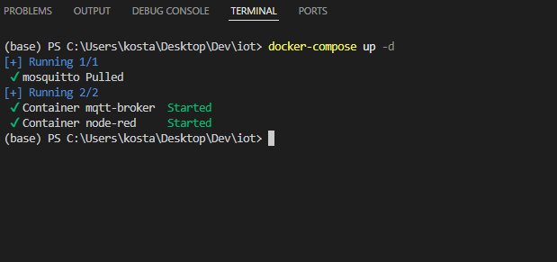
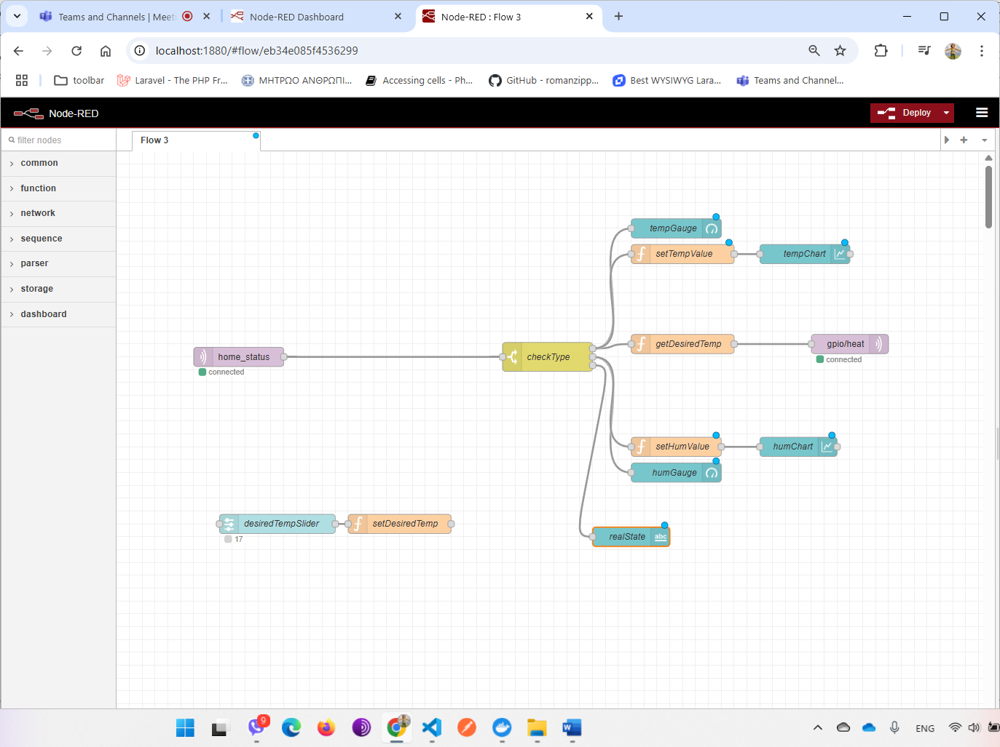
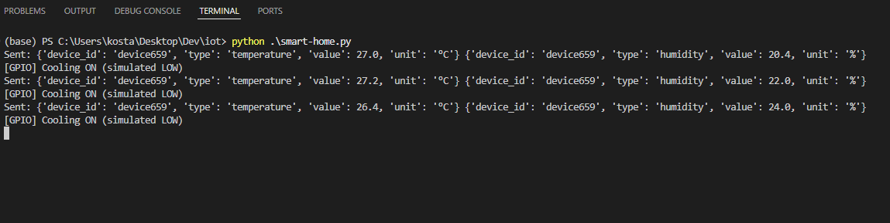

# Smart Home IoT System - Τεχνική Τεκμηρίωση

## 🔧 Περιγραφή Έργου

Η παρούσα εργασία υλοποιεί μια εφαρμογή Smart Home για τη συλλογή και επεξεργασία δεδομένων **θερμοκρασίας** και **υγρασίας** από εικονική IoT συσκευή (Raspberry Pi VM), με χρήση MQTT και Node-RED. Περιλαμβάνει επίσης έναν **εικονικό θερμοστάτη** με δυνατότητα ελέγχου **Ψύξης/Θέρμανσης**, βασισμένο σε καθορισμένη επιθυμητή θερμοκρασία από τον χρήστη.

---

## 🧱 Αρχιτεκτονική Συστήματος

Η συνολική υλοποίηση βασίζεται σε 3 βασικά στοιχεία:

* **Mosquitto MQTT Broker** (Docker Container)
* **Node-RED Server** (Docker Container)
* **Προσομοίωση IoT Συσκευής σε Raspbian Virtual Machine** με Python script (Publish + Receive)

---

## ⚙️ Τεχνολογίες & Εργαλεία

* Docker Desktop
* Mosquitto MQTT Broker
* Node-RED (v4.x)
* Python 3 (με `paho-mqtt`, `python-dotenv`)
* Raspbian Desktop VM σε VirtualBox

**Τοποθεσίες λήψης εργαλείων:**

* Docker Desktop: [https://www.docker.com/products/docker-desktop/](https://www.docker.com/products/docker-desktop/)
* Raspbian ISO: [https://www.raspberrypi.com/software/operating-systems/#raspberry-pi-desktop](https://www.raspberrypi.com/software/operating-systems/#raspberry-pi-desktop)

* VirtualBox: [https://www.virtualbox.org/wiki/Downloads](https://www.virtualbox.org/wiki/Downloads)

---

## 🐳 Docker Setup

### Βήμα 1: Δημιουργία φακέλου έργου

```bash
mkdir smart-home-iot
cd smart-home-iot
git clone https://github.com/ktsouvalis/iot-project.git .
```

### Βήμα 2: Ρύθμιση φακέλων για το Mosquitto

Δημιουργούμε τους υποφακέλους:

```bash
mkdir -p mosquitto/config mosquitto/data mosquitto/log
```

Και δημιουργούμε το αρχείο `mosquitto.conf` μέσα στο `mosquitto/config/` με το παρακάτω περιεχόμενο:

```conf
persistence true
persistence_location /mosquitto/data/
log_dest file /mosquitto/log/mosquitto.log
listener 1883
allow_anonymous true
```

📄 Δημιουργούμε επίσης αρχείο `.env` στο root directory του project:

```env
BROKER_IP=<ip_του_broker>
BROKER_PORT=1883
DEVICE_ID=virtual-pi-01 #Προαιρετικά
```

### Βήμα 3: Δημιουργία `docker-compose.yml`

```yaml
services:
  # ΜQTT Broker 
  mosquitto:
    image: eclipse-mosquitto # Official Mosquitto Broker Image
    container_name: mqtt-broker
    ports:
      - "1883:1883" # MQTT default port
      - "9001:9001" # WebSocket port
    volumes:
      - ./mosquitto/config:/mosquitto/config  # Configuration files
      - ./mosquitto/data:/mosquitto/data # Persistent data storage
      - ./mosquitto/log:/mosquitto/log # Log files

  # Node-RED for visual programming
  nodered:
    image: nodered/node-red # Official Node-RED Image
    container_name: node-red
    ports:
      - "1880:1880" # Node-RED default port
    depends_on:
      - mosquitto # Ensure Mosquitto starts first
    volumes:
      - ./nodered-data:/data # Persistent Node-RED data storage
```

▶ Εκκίνηση με:

```bash
docker-compose up -d
```

📷 **Screenshot: Εκκίνηση docker containers**



📷 **Screenshot: Επιβεβαίωση running containers στο Docker Desktop**


---

## 🧪 Python Script (IoT Simulator)

Η "συσκευή" προσομοιώνεται με script που δημοσιεύει περιοδικά τιμές θερμοκρασίας και υγρασίας και λαμβάνει εντολές μέσω MQTT.

📂 Αρχεία:

* `.env`

```
BROKER_IP=localhost
BROKER_PORT=1883
```

* `iot-sensor.py` (με δομή σε συναρτήσεις και σχόλια)

📦 Απαραίτητα Python πακέτα:

```bash
pip install paho-mqtt python-dotenv
```
---

## 🌡️ Node-RED Flows

Χρησιμοποιείται ένα flow που:

* Δέχεται MQTT δεδομένα και τα εμφανίζει σε Gauge/Chart



* Επιτρέπει στον χρήστη να ρυθμίζει θερμοκρασία μέσω slider

* Αποστέλλει εντολή COOL\_ON στη συσκευή


**Ή**

* Αποστέλλει εντολή HEAT\_ON στη συσκευή


* Δείχνει τις πληροφορίες του "αισθητήρα" υγρασίας


* Το αρχείο `flows.json` βρίσκεται στον φάκελο του έργου και μπορεί να εισαχθεί στο Node-RED από το Μενού -> Import.


---

## 🔁 MQTT Topics

* `home_status` – Δημοσίευση δεδομένων θερμοκρασίας, υγρασίας και acknowledgments
* `gpio/heat` – Αποστολή εντολών από Node-RED στον "θερμοστάτη"

---

## 📘 Οδηγίες Εκτέλεσης

1. Εκτέλεση Python script στο VM:

```bash
python3 iot-sensor.py
```


2. Άνοιγμα Node-RED Flows: [http://localhost:1880](http://localhost:1880)

3. Άνοιγμα Node-RED Dashboard: [http://localhost:1880/ui](http://localhost:1880/ui)

---

## 📌 Παρατηρήσεις

* Ολόκληρο το σύστημα είναι **φορητό** μέσω Docker Containers.
* Η συσκευή δεν είναι πραγματικό Raspberry Pi, αλλά προσομοιωμένη μέσω Raspbian VM.
* Τα flows μπορούν επίσης να εξαχθούν ή να αποθηκευτούν μέσω του volume binding του Node-RED στο docker-compose.yml

---

## ✍️ Στοιχεία Εργασίας

**Ονοματεπώνυμο**: Κωνσταντίνος Τσούβαλης (mscacs24020)
**Μάθημα**: Συστήματα ευφυούς διαχείρισης πόρων και υποδομών στο Διαδίκτυο των Αντικειμένων
**Ακαδημαϊκό Έτος**: 2024–2025
**Καθηγητής**: Παναγιώτης Καρκαζής

---
